# OCI Quickstart with the HR Sample Schema and Oracle REST Data Services

## Overview

This quickstart REST enables the [HR Oracle Database sample schema](https://github.com/oracle-samples/db-sample-schemas) in an Always Free Autonomous Database via Oracle REST Data Services (ORDS). It provides REST endpoints for most of the tables and allows insert, update and delete operations via POST, PUT and DELETE REST calls. There are also GET REST endpoints to get all the values in a table or an individual value in a table referenced by an ID.

Also included are two pieces of REST enabled business logic. The first is a check salaries REST API where you provide a job ID and a  salary and the REST service will check to see if the salary is or is not in the job IDs salary range. The parameters are passed via the URL for this service.

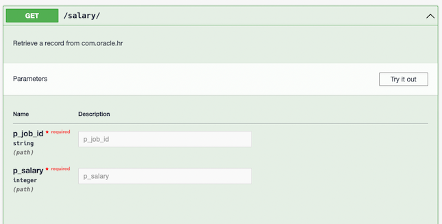

The second piece of business logic is for creating a new office using an office entity object. The office entity object is a combination of the locations, countries and regions tables into a single office entity or view. This REST API can create a new location with a new region and country, a new location with an existing location and country or a new office with a new country in an existing region.

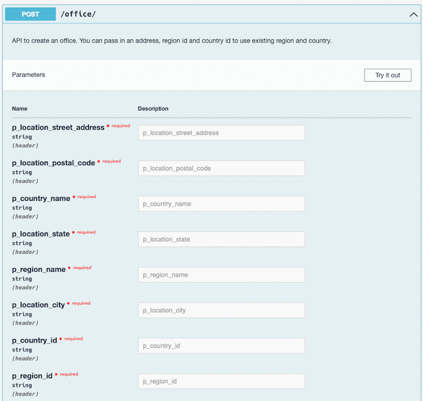

## About the Created Resources

Once the quickstart is installed, you can navigate to the REST workshop in Database Actions to view the created resource modules and templates.

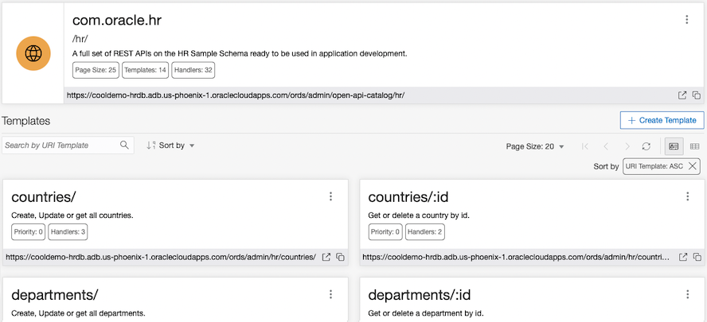

Clicking on any of the templates will show the REST methods/handlers available via the endpoint as well as the URLs to connect to them.

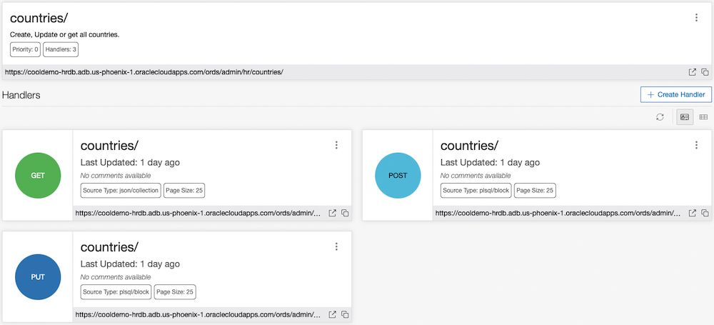

## Interacting with the REST Endpoints

You can use the REST endpoints in various ways such as cURL at a command line, directly in a browser for the GET endpoints or via a client tool. You can see examples of how to interact with these endpoints via cURL right in the UI. Find the endpoint you want to use and use the pop out menu to select **Get cURL command**.

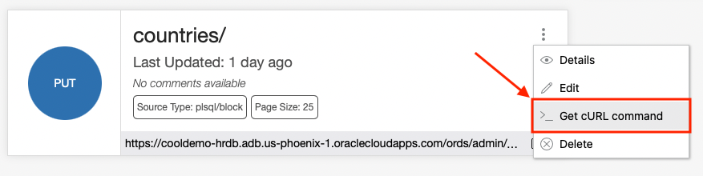

Now use the copy option in the popup modal to copy this cURL command and try out where you have cURL installed. You can also use the plus sign to use the Substitutions popup modal to assign values to the JSON payload.

Just assign the values in the modal

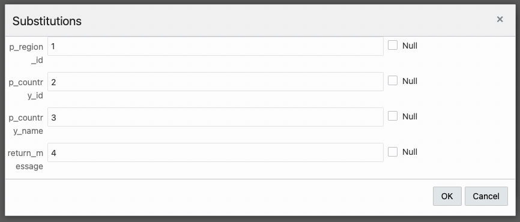

and you can see how they are added to the JSON payload in the cURL command.

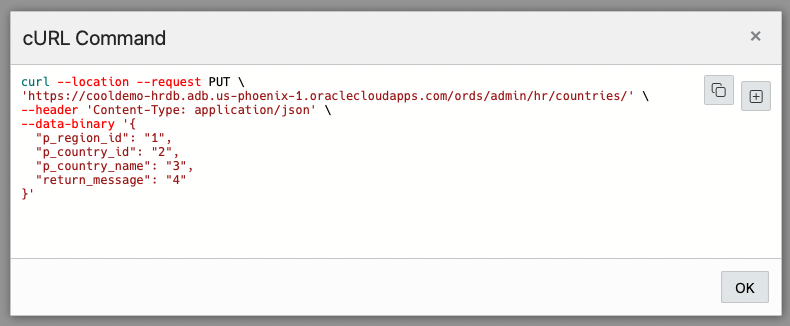

## Employee REST Example

Here is an example of using the GET Employee REST endpoint. We have two to choose from, the first one gets all the employees from the employees table and the second gets an employee by ID. This example will use the GET method that uses an ID.

To start, we can use the API in a browser window by clicking the Open in New Tab button right on the REST endpoint in the Handlers page.

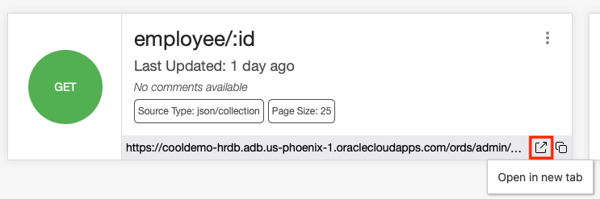

The endpoint knows it need a variable so the **Bind Variables modal** window asks for just this. 

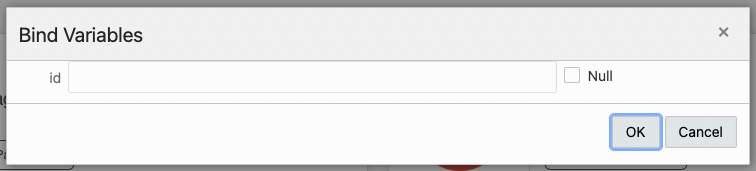

Enter in 100 and click OK.

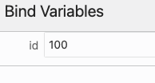

You can see the JSON response right in the browser window.

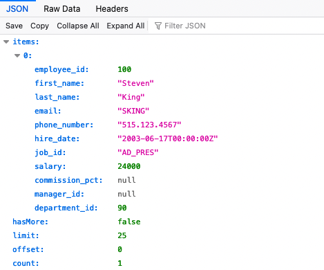

We can also use the cURL command that is auto-created for us. Again, back on the Handlers page, select **Get cURL Command** on the endpoint tile menu.

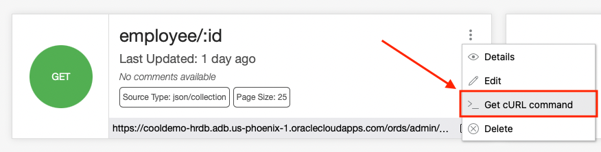

On the cURL Command modal, 

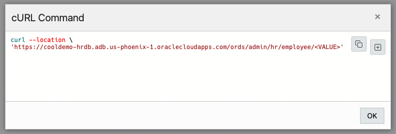

use the plus button to add our variable value to the command. 

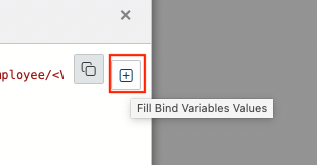

Again, use 100 as the value.

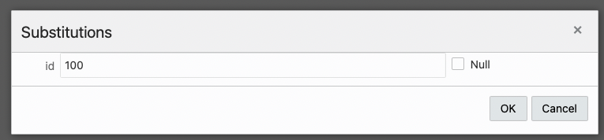

Once the value is in the cURL command, copy and paste this command into a terminal window where cURL is installed and run it. You will see the JSON payload response just as we did in the web browser.

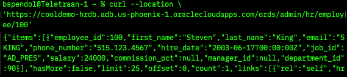


## About Oracle REST Data Services

Oracle REST Data Services (ORDS) bridges HTTPS and your Oracle Database. A mid-tier Java application, ORDS provides a Database Management REST API, SQL Developer Web, a PL/SQL Gateway, SODA for REST, and the ability to publish RESTful Web Services for interacting with the data and stored procedures in your Oracle Database.

The Java EE implementation offers increased functionality including a command line based configuration, enhanced security, file caching, and RESTful web services. Oracle REST Data Services also provides increased flexibility by supporting deployments using Oracle WebLogic Server, Apache Tomcat, and a standalone mode. Oracle REST Data Services further simplifies the deployment process because there is no Oracle home required, as connectivity is provided using an embedded JDBC driver.

## About RESTful Web Services

Representational State Transfer (REST) is a style of software architecture for distributed hypermedia systems such as the World Wide Web. An API is described as RESTful when it conforms to the tenets of REST. Although a full discussion of REST is outside the scope of this document, a RESTful API has the following characteristics:

- Data is modeled as a set of resources. Resources are identified by URIs.
- A small, uniform set of operations are used to manipulate resources (for example, PUT, POST, GET, DELETE).
- A resource can have multiple representations (for example, a blog might have an HTML representation and an RSS representation).
- Services are stateless and since it is likely that the client will want to access related resources, these should be identified in the representation returned, typically by providing hypertext links.

### RESTful Services Terminology

This section introduces some common terms that are used throughout this lab:

**RESTful service**: An HTTP web service that conforms to the tenets of the RESTful architectural style.

**Resource module**: An organizational unit that is used to group related resource templates.

**Resource template**: An individual RESTful service that is able to service requests for some set of URIs (Universal Resource Identifiers). The set of URIs is defined by the URI Pattern of the Resource Template

**URI pattern**: A pattern for the resource template. Can be either a route pattern or a URI template, although you are encouraged to use route patterns.

**Route pattern**: A pattern that focuses on decomposing the path portion of a URI into its component parts. For example, a pattern of /:object/:id? will match /emp/101 (matches a request for the item in the emp resource with id of 101) and will also match /emp/ (matches a request for the emp resource, because the :id parameter is annotated with the ? modifier, which indicates that the id parameter is optional).

**URI template**: A simple grammar that defines the specific patterns of URIs that a given resource template can handle. For example, the pattern employees/{id} will match any URI whose path begins with employees/, such as employees/2560.

**Resource handler**: Provides the logic required to service a specific HTTP method for a specific resource template. For example, the logic of the GET HTTP method for the preceding resource template might be:
```
select empno, ename, dept from emp where empno = :id
```
**HTTP operation**: HTTP (HyperText Transport Protocol) defines standard methods that can be performed on resources: GET (retrieve the resource contents), POST (store a new resource), PUT (update an existing resource), and DELETE (remove a resource).


## Visual Model of the HR Schema

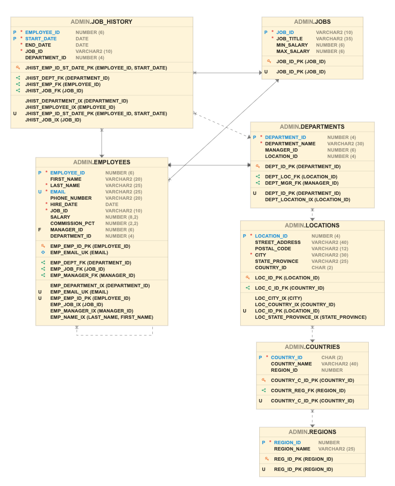
